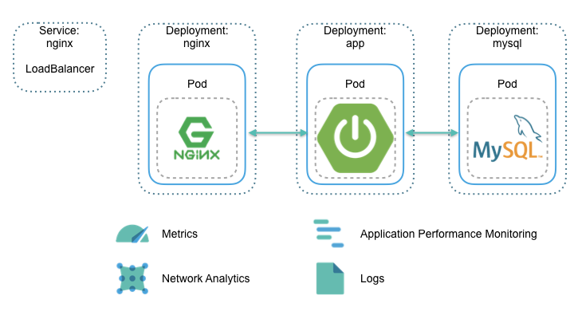

# apm-beats-kubernetes-demo
This is APM &amp; Beats demo on k8s.

This repository includes the following:

* Spring Boot app - /apm-Demo
* Kubernetes deployment yaml - /kubernetes
* Nginx config and Dockerfile - /nginx

Not include Elasticsearch & Kibana deployment. Elasticsearch & Kibana need to be prepared by yourself.

## Demo scenario

This demo runs on Kubernetes, it's composed of a simple Spring Boot app, with a Nginx frontend. It uses MySQL as data backend.

Everything is monitored using Beats and Elastic APM.

* [Filebeat](https://www.elastic.co/guide/en/beats/filebeat/6.3/running-on-kubernetes.html) ships logs from all running containers, enriched with Kubernetes metadata
* [Metricbeat](https://www.elastic.co/guide/en/beats/metricbeat/6.3/running-on-kubernetes.html) ships system metrics for all nodes in the cluster and Kubernetes metrics on containers resource consumption and state
* [Packetbeat](https://www.elastic.co/guide/en/beats/packetbeat/6.3/index.html) monitors the network and applications by sniffing packets
* [Elastic APM](https://www.elastic.co/guide/en/apm/get-started/master/index.html) gather tracing timing data from your applications

## TODO

* Add how to setup
